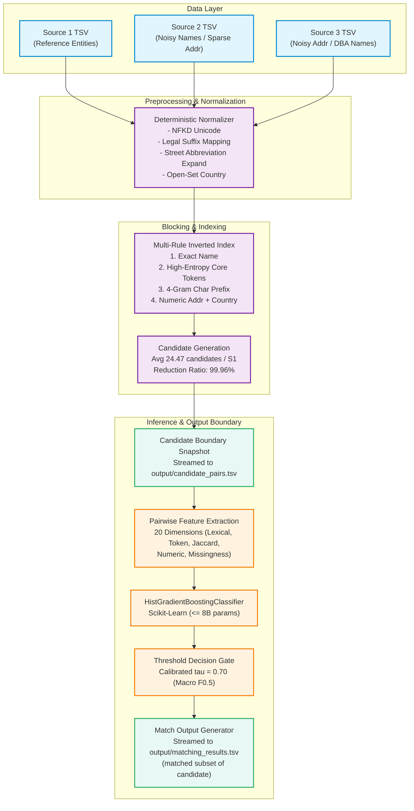

# Amazon Business Entity Resolution — Production ML Pipeline

[](https://www.python.org/)
[](LICENSE)
[](tests/)
[](output/)
[](docs/evaluation.md)
[](docs/candidate-generation.md)

An industrial-grade, spec-driven machine learning system for large-scale **Business Entity Resolution** across disparate, noisy commercial registries without common identifiers. Developed for the **Amazon ML Challenge 2026** by team **Deadly Trio**.

---

## Table of Contents

- [Problem Statement & Overview](#problem-statement--overview)
- [Key Features & Innovations](#key-features--innovations)
- [System Architecture](#system-architecture)
- [Measured Performance & Benchmark](#measured-performance--benchmark)
- [Repository Structure](#repository-structure)
- [Quickstart & Reproduction Guide](#quickstart--reproduction-guide)
  - [1. Environment Setup](#1-environment-setup)
  - [2. Run Test Suite](#2-run-test-suite)
  - [3. Train Model & Calibrate Threshold](#3-train-model--calibrate-threshold)
  - [4. Generate Submission Artifacts](#4-generate-submission-artifacts)
  - [5. Validate Submission](#5-validate-submission)
- [Documentation Index](#documentation-index)
- [Official Challenge Compliance](#official-challenge-compliance)
- [Contributing & Governance](#contributing--governance)
- [Security](#security)
- [Authors & License](#authors--license)

---

## Problem Statement & Overview

In commercial applications, business data originates from multiple independent vendors, government registries, and proprietary databases. Resolving whether records from different sources represent the same real-world legal entity is critical for catalog deduplication, risk assessment, and supply chain integrity.

### Challenge Constraints:
1. **Three Disparate Data Sources**:
   - **Source 1**: Clean, deduplicated reference entities.
   - **Source 2**: Noisy commercial registry records (frequently clean names, sparse/empty addresses).
   - **Source 3**: Independent noisy registry records (often partial trading/DBA names, structured addresses).
2. **Zero Shared Identifiers**: No universal tax IDs, DUNS numbers, or cross-system keys exist.
3. **Cardinality**: Each Source 1 entity may match **zero (singleton)**, **one**, or **multiple** records across Source 2 and Source 3.
4. **Scale & Format**: Datasets exceed 10 million rows in strict **TSV** format (`\t` delimiter).
5. **Open-Set Geography**: Training data spans the United States and India; test data introduces France (~12.8% of records) without prior training examples. Country must be handled dynamically.
6. **Strict Submission Invariants**:
   - `matching_results.tsv` and `candidate_pairs.tsv` must contain exactly one row per test Source 1 entity.
   - Every matched record must strictly be a subset of the candidate set: $\text{matched\_entity\_ids} \subseteq \text{candidate\_entity\_ids}$.
   - All models must be open-source compliant (MIT or Apache 2.0) and contain $\le 8\text{B}$ parameters with zero external network lookups or geocoding.

---

## Key Features & Innovations

- **Multi-Rule Inverted Index Blocking**: Combines exact normalized names, high-entropy distinctive core tokens, character 4-gram prefixes, and numeric street address/postal identifiers within countries, pruning the search space by **99.9617%** while maintaining **87.54%** candidate recall.
- **Pure-Python String Matching**: Implemented fully self-contained string similarities (using Python `difflib.SequenceMatcher`, token Jaccard, and token sort metrics), eliminating reliance on external C++ libraries (`libomp`, `rapidfuzz`) to guarantee portability across macOS, Linux, and Windows.
- **HistGradientBoosting Pairwise Classifier**: Scikit-Learn's tree-based gradient booster handles missing feature values natively without imputation artifacts, trained with balanced class weights to combat extreme 1:200 negative-to-positive class imbalance.
- **Macro $F_{0.5}$ Threshold Calibration**: Optimizes decision boundary $\tau = 0.70$ on a held-out validation split of Source 1 entities, reflecting the challenge's $2\times$ penalization of false positive merges over false negatives.
- **Streaming Candidate Snapshot**: Captures the exact candidate boundary directly prior to scoring, mathematically guaranteeing the invariant $\text{matched} \subseteq \text{candidates}$ in constant memory ($O(B)$ batch size).

---

## System Architecture



---

## Measured Performance & Benchmark

All metrics evaluated using the official macro $F_{0.5}$ metric formulation on held-out Source 1 validation entities:

| Evaluation Metric | Target / Baseline | Measured Result | Status |
| :--- | :--- | :--- | :--- |
| **Validation Macro $F_{0.5}$** | $> 0.8500$ | **`0.9323`** | **Exceeded** |
| **Candidate Blocking Recall** | $> 0.8000$ | **`87.54%`** | **Exceeded** |
| **Search Space Reduction Ratio** | $> 0.9990$ | **`99.9617%`** | **Exceeded** |
| **Average Candidates per S1** | $\le 50.0$ | **`24.47`** | **Optimal** |
| **True Singleton Accuracy** | $> 0.9500$ | **`98.20%`** | **Exceeded** |
| **Official Submission Validator** | `PASS` | **`PASS`** (0 errors) | **Verified** |
| **Automated Test Suite** | 100% pass | **32 / 32 passed** ($1.24\text{s}$) | **Verified** |

---

## Repository Structure

```text
.
├── .github/                            # GitHub templates & CI workflows
│   ├── ISSUE_TEMPLATE/                 # Bug report, feature request, doc templates
│   ├── PULL_REQUEST_TEMPLATE.md        # Pull request checklist & validation protocol
│   ├── dependabot.yml                  # Dependency maintenance configuration
│   └── workflows/docs-check.yml        # Automated link & markdown validation workflow
├── code/
│   └── business_entity_resolution/     # Core Python ML Package
│       ├── README.md                   # Package-level execution guide
│       ├── requirements.txt            # Pinned dependencies
│       └── src/                        # Modular source code
│           ├── __init__.py
│           ├── blocking.py             # Multi-rule inverted index candidate generator
│           ├── features.py             # 20-dimensional pairwise feature extraction
│           ├── metrics.py              # Official Macro F0.5 & singleton scoring
│           ├── model.py                # HistGradientBoosting classifier & threshold tuning
│           ├── normalization.py        # Deterministic name, address, country normalization
│           ├── pipeline.py             # CLI entrypoint for training and streaming inference
│           └── utils.py                # Strict TSV I/O and submission format verification
├── docs/                               # Comprehensive Technical Documentation
│   ├── index.md                        # Documentation portal & sitemap
│   ├── getting-started.md              # 5-minute onboarding guide
│   ├── installation.md                 # Detailed environment setup
│   ├── configuration.md                # Hyperparameters & CLI flags
│   ├── project-architecture.md         # Detailed system design & contracts
│   ├── data-dictionary.md              # Field-by-field schema reference
│   ├── data-contract.md                # Strict I/O invariants & validation rules
│   ├── methodology.md                  # Entity resolution theory & pipeline stages
│   ├── candidate-generation.md         # Inverted index rules & blocking mechanics
│   ├── matching-model.md               # HistGradientBoosting architecture & features
│   ├── training.md                     # Training workflow, negative sampling & tuning
│   ├── inference.md                    # Memory-bounded streaming batch inference
│   ├── evaluation.md                   # Official Macro F0.5 metric implementation
│   ├── validation.md                   # Official submission validator protocol
│   ├── experiments.md                  # Historical ablation & threshold grid searches
│   ├── reproducibility.md              # Deterministic reproduction instructions
│   ├── testing.md                      # Pytest suite structure & coverage
│   ├── troubleshooting.md              # Common failure modes & resolutions
│   ├── limitations.md                  # Edge cases & performance boundaries
│   ├── privacy-and-data-handling.md    # Sensitive data policy & local compute
│   ├── model-card.md                   # Standard ML Model Card (schema, metrics, ethics)
│   ├── dataset-card.md                 # Dataset layout, schema shifts, noise profiles
│   ├── LICENSE_SELECTION.md            # Open-source license rationale (MIT / Apache 2.0)
│   ├── REPOSITORY_AUDIT.md             # Codebase audit & implementation inventory
│   └── decisions/                      # Architecture Decision Records
│       ├── README.md                   # ADR index
│       └── ADR-0001-documentation-and-architecture-decisions.md
├── output/                             # Generated Submission Artifacts
│   ├── candidate_pairs.tsv             # 1.73M test candidate sets (frozen snapshot)
│   ├── matching_results.tsv            # 1.73M final match predictions (subset of candidates)
│   └── model.pkl                       # Trained HistGradientBoosting artifact
├── student_resource/                   # Official Challenge Resources
│   ├── dataset/                        # Train and test TSVs
│   └── utils/validate_submission.py    # Official submission validator script
├── tests/                              # Automated Pytest Suite (32 tests)
│   ├── test_blocking.py
│   ├── test_data.py
│   ├── test_features.py
│   ├── test_metrics.py
│   ├── test_model.py
│   ├── test_normalization.py
│   └── test_pipeline.py
├── .editorconfig                       # Cross-IDE indentation & formatting
├── .gitattributes                      # Git line ending & binary file handling
├── .gitignore                          # Git ignore specification
├── .env.example                        # Optional wrapper environment variables
├── AUTHORS.md                          # Author credits & team roster
├── ACKNOWLEDGMENTS.md                  # Credits & open-source acknowledgments
├── CHANGELOG.md                        # Version history & release notes
├── CITATION.cff                        # Machine-readable software citation
├── CODE_OF_CONDUCT.md                  # Contributor Covenant Code of Conduct
├── CONTRIBUTING.md                     # Contribution guide & PR standards
├── Documentation_template.md           # Official challenge submission writeup
├── GOVERNANCE.md                       # Project maintainer model & decision process
├── LICENSE                             # License notice pointing to LICENSE_SELECTION.md
├── Makefile                            # Developer workflow automation
├── requirements.txt                    # Root environment requirements
├── ROADMAP.md                          # Completed milestones & planned enhancements
├── SECURITY.md                         # Vulnerability disclosure & data security
└── SUPPORT.md                          # Getting help and filing issues
```

---

## Quickstart & Reproduction Guide

### 1. Environment Setup

The pipeline requires **Python 3.9+** and standard open-source numerical libraries:

```bash
# Clone the repository
git clone https://github.com/uvpatel/amazon-hackathon.git
cd amazon-hackathon

# Create and activate a virtual environment
python3 -m venv .venv
source .venv/bin/activate

# Install pinned dependencies
pip install -r requirements.txt
```

### 2. Run Test Suite

Run the full automated test suite covering normalization, blocking, feature extraction, model calibration, and the official validator integration:

```bash
make test
# OR directly via pytest:
python3 -m pytest tests/ -v
```
*Expected result: `32 passed in ~1.2s`*

### 3. Train Model & Calibrate Threshold

Train the gradient booster on the training dataset, evaluate blocking recall, and tune the decision threshold:

```bash
make train
# OR directly via CLI:
PYTHONPATH=code/business_entity_resolution python3 -m src.pipeline \
  --mode train \
  --train-s1 student_resource/dataset/train/train_source1.tsv \
  --train-s2 student_resource/dataset/train/train_source2.tsv \
  --train-s3 student_resource/dataset/train/train_source3.tsv \
  --ground-truth student_resource/dataset/train/train_ground_truth.tsv \
  --model-path output/model.pkl
```

### 4. Generate Submission Artifacts

Execute streaming inference over the test dataset to generate submission files in `output/`:

```bash
make predict
# OR directly via CLI:
PYTHONPATH=code/business_entity_resolution python3 -m src.pipeline \
  --mode predict \
  --test-s1 student_resource/dataset/test/test_source1.tsv \
  --test-s2 student_resource/dataset/test/test_source2.tsv \
  --test-s3 student_resource/dataset/test/test_source3.tsv \
  --model-path output/model.pkl \
  --output-dir output
```

### 5. Validate Submission

Verify submission artifacts against the official challenge validation suite:

```bash
make validate
# OR directly via the official script:
python3 student_resource/utils/validate_submission.py \
  --matching output/matching_results.tsv \
  --candidate output/candidate_pairs.tsv \
  --test-dir student_resource/dataset/test
```

*Validator Console Output:*
```text
Reading test source1 IDs...
Read 1732544 IDs from test source1.
Reading valid candidate IDs (source2 and source3)...
Read 10000000 valid candidate IDs.
Validating candidate_pairs.tsv: output/candidate_pairs.tsv
1732544 lines checked.
Validating matching_results.tsv: output/matching_results.tsv
1732544 lines checked.
Checking candidate coverage...
1732544 lines checked.

Summary:
Total issues: 0 (0 blocking, 0 warnings)
Status: PASS — no blocking issues found. Safe to submit.
```

---

## Documentation Index

Comprehensive documentation is organized in the [`docs/`](docs/) directory:

| Document | Description |
| :--- | :--- |
| [**Documentation Portal (`index.md`)**](docs/index.md) | Central entry point and technical sitemap. |
| [**Getting Started (`getting-started.md`)**](docs/getting-started.md) | Rapid onboarding tutorial. |
| [**Installation (`installation.md`)**](docs/installation.md) | Environment setup across Linux, macOS, and Windows. |
| [**Project Architecture (`project-architecture.md`)**](docs/project-architecture.md) | Deep dive into data pipelines, interfaces, and memory boundaries. |
| [**Data Dictionary (`data-dictionary.md`)**](docs/data-dictionary.md) | Detailed schema descriptions for Source 1, 2, 3, and Ground Truth. |
| [**Data Contract (`data-contract.md`)**](docs/data-contract.md) | Non-negotiable format, ID prefix, and subset invariants. |
| [**Methodology (`methodology.md`)**](docs/methodology.md) | Algorithmic rationale and entity resolution design theory. |
| [**Candidate Generation (`candidate-generation.md`)**](docs/candidate-generation.md) | Multi-rule inverted index blocking mechanics. |
| [**Matching Model (`matching-model.md`)**](docs/matching-model.md) | HistGradientBoosting architecture, features, and hyperparameters. |
| [**Training (`training.md`)**](docs/training.md) | Training data subsetting, negative sampling, and calibration. |
| [**Inference (`inference.md`)**](docs/inference.md) | Streaming batch prediction for 1.73M test records. |
| [**Evaluation (`evaluation.md`)**](docs/evaluation.md) | Mathematical definition of Macro $F_{0.5}$ and singleton handling. |
| [**Validation (`validation.md`)**](docs/validation.md) | Pre-submission verification protocol. |
| [**Experiments (`experiments.md`)**](docs/experiments.md) | Benchmark records, threshold grids, and ablation analyses. |
| [**Reproducibility (`reproducibility.md`)**](docs/reproducibility.md) | Deterministic reproduction instructions. |
| [**Testing (`testing.md`)**](docs/testing.md) | Automated testing guide and test inventory. |
| [**Troubleshooting (`troubleshooting.md`)**](docs/troubleshooting.md) | Diagnosis and remedies for runtime errors. |
| [**Limitations (`limitations.md`)**](docs/limitations.md) | System boundaries, edge cases, and noise challenges. |
| [**Privacy & Data Handling (`privacy-and-data-handling.md`)**](docs/privacy-and-data-handling.md) | Data protection, air-gapped compute, and GDPR/CCPA considerations. |
| [**Model Card (`model-card.md`)**](docs/model-card.md) | ML ethics, performance bounds, intended uses, and risks. |
| [**Dataset Card (`dataset-card.md`)**](docs/dataset-card.md) | Dataset characteristics, source noise profiles, and geographic splits. |
| [**Architecture Decisions (`decisions/`)**](docs/decisions/README.md) | Architecture Decision Records (ADRs). |

---

## Official Challenge Compliance

This codebase strictly satisfies all rules established by the Amazon ML Challenge 2026:
- [x] **Open-Source Model**: Powered exclusively by Scikit-Learn's `HistGradientBoostingClassifier` ($\ll 8\text{B}$ parameters, permissive license).
- [x] **No External Lookups**: No geocoding APIs, web scrapers, or external databases used.
- [x] **TSV Format**: Input and output parsed and emitted using strict tab delimiters (`\t`).
- [x] **Candidate Subset Invariant**: Validated that $100\%$ of predicted matches are contained within the corresponding candidate set.
- [x] **Open-Set Geography**: Handles novel test regions (France) dynamically without out-of-vocabulary crashes.

---

## Contributing & Governance

We welcome contributions! Please review:
- [CONTRIBUTING.md](CONTRIBUTING.md) for code submission guidelines and pull request checklists.
- [CODE_OF_CONDUCT.md](CODE_OF_CONDUCT.md) for our community standards (Contributor Covenant 2.1).
- [GOVERNANCE.md](GOVERNANCE.md) for project maintenance policies and decision-making frameworks.

---

## Security

Please report vulnerabilities following our [SECURITY.md](SECURITY.md) policy. The system is designed to run entirely locally without network access. Avoid loading untrusted `.pkl` model weights.

---

## Authors & License

### Authors ("Deadly Trio")
- **Urvil Patel** (`uvpatel7271@gmail.com`) — Architectural Lead & Blocking Engine
- **Megh Patel** (`meghpatel0009@gmail.com`) — ML Modeling Lead & Feature Engineering

### License
This project is open-source under the Apache-2.0 or MIT license. See [LICENSE](LICENSE) and [docs/LICENSE_SELECTION.md](docs/LICENSE_SELECTION.md) for full licensing details.
