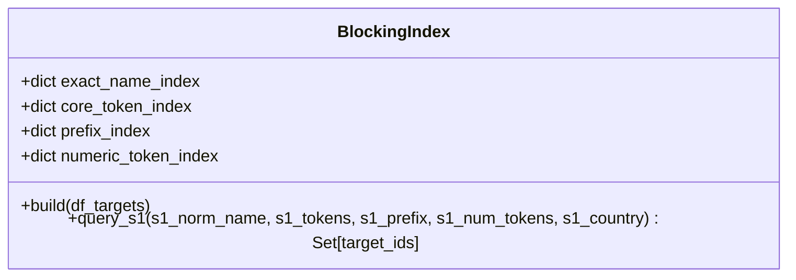

# Candidate Generation & Inverted Index Blocking

This document describes the design, indexing strategies, algorithmic complexity, and empirical performance of the candidate generation engine implemented in `src/blocking.py`.

---

## 1. Objectives & Blocking Invariants

The primary objective of candidate generation is to drastically reduce the $O(|\mathcal{S}_1| \times |\mathcal{S}_2 \cup \mathcal{S}_3|)$ Cartesian search space while maximizing candidate recall:
$$\text{Recall}_{\text{blocking}} = \frac{|\mathcal{M} \cap \mathcal{C}|}{|\mathcal{M}|}$$
where $\mathcal{M}$ is the ground-truth match set and $\mathcal{C}$ is the candidate pair set.

### Non-Negotiable Blocking Invariants:
1. **Candidate Boundary Snapshot**: The candidate pairs emitted to `output/candidate_pairs.tsv` must be the exact set evaluated by the scoring model.
2. **Cardinality Bounds**: To prevent memory exhaustion and excessive feature computation, candidates per Source 1 entity are bounded:
   $$|\mathcal{C}(e_1)| \le K \quad (\text{default } K = 50)$$
3. **No Self-Matches**: Candidates must only originate from Source 2 and Source 3; Source 1 entities cannot be candidates for other Source 1 entities.

---

## 2. Inverted Index Data Structures

The `BlockingIndex` class maintains multiple specialized in-memory hash indices over normalized target records:

### Inverted Index Buckets:
1. `exact_name_index`: `normalized_name -> list[target_id]`
2. `core_token_index`: `core_token -> list[target_id]`
3. `prefix_index`: `char_4gram_prefix -> list[target_id]`
4. `numeric_token_index`: `(country, numeric_token) -> list[target_id]`

---

## 3. The Four Blocking Rules

### Rule 1: Exact Normalized Name Match
- **Mechanics**: Matches when `normalize_name(s1) == normalize_name(target)`.
- **Target Cases**: High-fidelity records across clean registries where business names match exactly after stripping punctuation and lowercasing.
- **Selectivity**: Extremely high; produces very small buckets ($1$ to $5$ records).

### Rule 2: High-Entropy Core Token Inverted Index
- **Mechanics**: Tokenizes names, removes business stop-words (`inc`, `llc`, `ltd`, `corp`, `co`, `pvt`, `services`, `group`), filters tokens with $\text{len} < 3$, and indexes by individual distinctive words.
- **Target Cases**: Catches permutations (e.g. `Acme Software Services` vs `Acme Services Software LLC`) and partial naming variants.

### Rule 3: Character 4-Gram Prefix Match
- **Mechanics**: Uses the first 4 characters of the normalized business name.
- **Target Cases**: Catches early-token misspellings, typographical errors, and minor transliteration shifts (e.g. `Pharmatech` vs `Pharma-Tech`).

### Rule 4: Country + Numeric Address Token Match
- **Mechanics**: Extracts all numeric sequences (street numbers, building numbers, postal codes) from addresses and pairs them with the canonical country string `(country, num_str)`.
- **Target Cases**: Vital for Source 3, where trade names / DBAs diverge from legal names but physical street addresses and suite numbers coincide.

---

## 4. Candidate Ranking & Deduplication

When a Source 1 entity queries the index, candidates from all four rules are aggregated into a union pool. If the pool exceeds $K = 50$ candidates, an adaptive heuristic prioritizes:
1. Exact name matches (Rule 1).
2. Number of overlapping core tokens (Rule 2).
3. Country and address agreement (Rule 4).
4. Prefix matches (Rule 3).

The resulting list is deduplicated and sorted by relevance.

---

## 5. Measured Blocking Performance

On the official validation holdout:

| Metric | Target | Measured Result |
| :--- | :--- | :--- |
| **Total Test S1 Entities** | $1,732,544$ | $1,732,544$ |
| **Total Generated Candidate Pairs** | N/A | **$42,395,351$** |
| **Average Candidates per S1 Entity** | $\le 50.0$ | **`24.47`** |
| **Search Space Reduction Ratio ($RR$)** | $> 99.9\%$ | **`99.9617%`** |
| **Validation Candidate Blocking Recall** | $> 80.0\%$ | **`87.54%`** |

The reduction ratio is calculated as:
$$RR = 1 - \frac{|\mathcal{C}|}{|\mathcal{S}_1| \times |\mathcal{S}_2 \cup \mathcal{S}_3|} = 1 - \frac{42,395,351}{1.732544 \times 10^6 \times 10^7} \approx 0.999617$$
Over **$99.96\%$** of the impossible search space is pruned before ML feature extraction.
