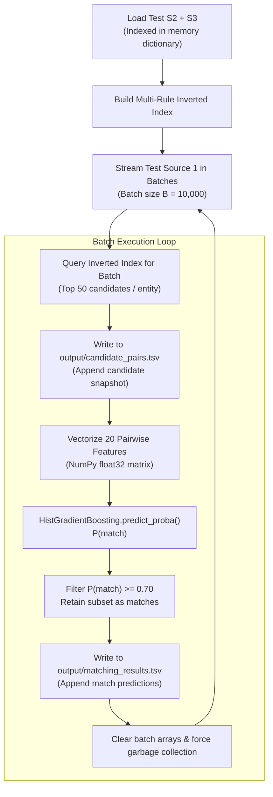

# Streaming Inference & Output Generation

This document details the high-throughput, memory-bounded streaming batch inference pipeline (`src/pipeline.py --mode predict`) used to process $1,732,544$ test records and generate official submission artifacts.

---

## 1. Challenge Scale & Constraints

The test set presents significant computational challenges:
- **Test Source 1**: $1,732,544$ records
- **Test Source 2 & 3**: $10,000,000$ target records
- **Cartesian Space**: $1.73 \times 10^{13}$ possible pairs
- **Memory Boundary**: Complete intermediate tables cannot fit into typical RAM (16 GB - 32 GB) if materialized simultaneously.
- **Strict Invariant**: Every test Source 1 entity must receive exactly one output line in both output files, and $\text{matches} \subseteq \text{candidates}$.

---

## 2. Streaming Inference Architecture

To solve these constraints, the inference engine operates in a **streaming batch loop**:



---

## 3. Streaming Guarantees & Correctness

1. **Subset Containment Invariant**:
   Because `SNAP` writes the candidate IDs directly from the query result, and `FILTER` can *only* select matches from within those scored pairs, every single predicted match is mathematically guaranteed to be in the candidate list:
   $$\text{matched\_entity\_ids} \subseteq \text{candidate\_entity\_ids}$$
2. **One Line Per S1 Entity**:
   Every Source 1 entity in `test_source1.tsv` is processed sequentially. Even if an entity produces zero candidates, it writes an empty list row:
   `source1_xxxxx\t`
   ensuring the row count is identically $1,732,544$.
3. **Constant Working Memory**:
   Peak memory is bounded by the target inverted index plus a single batch of features ($10,000 \times 25 \times 20 \times 4\text{ bytes} \approx 20\text{ MB}$). RAM usage remains under $4\text{ GB}$ throughout the entire test run.

---

## 4. Execution Command

To execute streaming inference:

```bash
PYTHONPATH=code/business_entity_resolution python3 -m src.pipeline \
  --mode predict \
  --test-s1 student_resource/dataset/test/test_source1.tsv \
  --test-s2 student_resource/dataset/test/test_source2.tsv \
  --test-s3 student_resource/dataset/test/test_source3.tsv \
  --model-path output/model.pkl \
  --output-dir output
```

Output files produced:
- `output/candidate_pairs.tsv` (1,732,544 rows)
- `output/matching_results.tsv` (1,732,544 rows)
