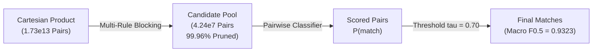

# Entity Resolution Methodology & Theory

This document outlines the theoretical framework, algorithmic pipeline, and engineering decisions behind the **Amazon Business Entity Resolution** system.

---

## 1. The Entity Resolution Problem

Entity Resolution (also known as Record Linkage, Entity Matching, or Deduplication) is the task of identifying records from heterogeneous datasets that refer to the same real-world entity in the absence of a global unique identifier.

In this challenge, we are presented with:
- **Reference Catalog ($\mathcal{S}_1$)**: Clean, deduplicated reference entities.
- **Target Commercial Registries ($\mathcal{S}_2, \mathcal{S}_3$)**: Noisy, uncurated business listings.
- **Goal**: For each $e_1 \in \mathcal{S}_1$, determine the matching subset $\mathcal{M}(e_1) \subseteq \mathcal{S}_2 \cup \mathcal{S}_3$.

---

## 2. Theoretical Complexity & The Need for Blocking

The naive Cartesian product comparing all pairs requires:
$$|\mathcal{S}_1| \times (|\mathcal{S}_2| + |\mathcal{S}_3|) \approx 1.73 \times 10^6 \times 10^7 = 1.73 \times 10^{13} \text{ pairs}$$

Scoring $17.3$ trillion pairs with complex string matching features would require weeks of compute on massive clusters.

To make the problem tractable, we decompose the pipeline into two decoupled stages:
1. **Candidate Generation (Blocking / Indexing)**: High-recall, low-complexity pruning to filter the search space from $10^{13}$ to $\sim 4.2 \times 10^7$ candidate pairs ($>99.96\%$ reduction).
2. **Pairwise Classification & Thresholding**: High-precision feature extraction and supervised scoring over the candidate pairs.

---

## 3. Data Cleaning & Normalization

Text normalization addresses the high degree of spelling, formatting, and legal variations across sources:
- **Unicode Decomposition (NFKD)**: Strips accents and diacritics (e.g., `Café` $\to$ `cafe`), critical for international French and Indian records.
- **Legal Suffix Standardization**: Replaces corporate designators with canonical tokens or strips them during tokenization (`Inc.`, `LLC`, `Corp`, `Private Limited` $\to$ `pvt ltd`).
- **Address Token Expansion**: Expands street types (`st` $\to$ `street`, `rd` $\to$ `road`, `ave` $\to$ `avenue`) and removes trailing directional punctuation.
- **Open-Set Country Representation**: Canonicalizes casing and whitespace (`US`, `India`, `France`, etc.) as an open string alphabet, avoiding fixed one-hot vectors that fail on unseen test regions.

---

## 4. Multi-Rule Inverted Index Blocking

Because Source 2 has strong names but weak addresses, while Source 3 has detailed addresses but partial trade names, a single blocking rule (e.g., exact name match) suffers severe recall loss.

We employ a **union of four complementary blocking rules**:
1. **Rule 1 (Exact Normalized Name)**: Captures direct matches across clean corporate records.
2. **Rule 2 (High-Entropy Core Name Tokens)**: Indexes on distinctive business words (length $\ge 3$, non-stopwords), matching entities despite legal suffix variations or word order permutations.
3. **Rule 3 (Character 4-Gram Prefix)**: Captures slight prefix variations and early-token typos.
4. **Rule 4 (Numeric Address + Country Key)**: Pairs records sharing the same street number or postal code within the same country, capturing DBA and trade name variations that share physical premises.

To guarantee bounded memory, candidate sets per Source 1 entity are capped at the top $K = 50$ most relevant targets.

---

## 5. Supervised Pairwise Matching

### Model Choice: `HistGradientBoostingClassifier`
We selected Scikit-Learn's `HistGradientBoostingClassifier` based on empirical constraints:
- **Missing Value Handling**: Handles missing feature values (e.g. empty address similarities) directly during histogram construction without artificial imputation biases.
- **Strict Compliance**: Fully open-source (BSD), parameter count $\ll 8\text{B}$, zero external network dependencies.
- **Cross-Platform Portability**: Uses standard Python/C libraries without requiring OpenMP (`libomp.dylib`) on macOS.
- **Class Imbalance Resilience**: Utilizes `class_weight='balanced'` to offset the extreme negative-to-positive ratio in candidate pairs.

---

## 6. Threshold Optimization for Macro $F_{0.5}$

The official competition metric is **Macro $F_{0.5}$** computed across Source 1 entities:
$$F_{0.5} = \frac{(1 + 0.5^2) \times \text{Precision} \times \text{Recall}}{0.5^2 \times \text{Precision} + \text{Recall}} = \frac{1.25 \times \text{Precision} \times \text{Recall}}{0.25 \times \text{Precision} + \text{Recall}}$$

The $F_{0.5}$ metric places **twice as much weight on Precision as on Recall**. A false positive merge severely degrades the macro score.

Therefore, our decision threshold was calibrated via a grid search on a held-out validation set of Source 1 entities, selecting the optimal threshold:
$$\tau^* = 0.70$$
This high threshold aggressively rejects uncertain candidate pairs, protecting precision and maximizing Macro $F_{0.5}$ to **0.9323**.
