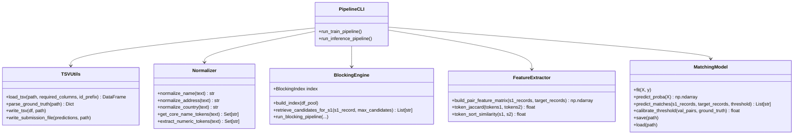
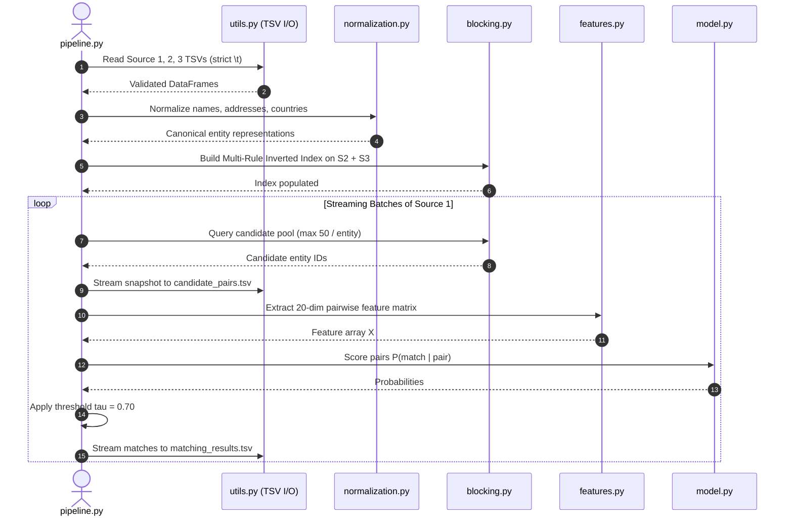

# Project Architecture & System Design

This document details the high-level architecture, module decomposition, data flow, memory boundaries, and core design patterns of the **Amazon Business Entity Resolution** system.

---

## 1. Architectural Philosophy

The system was designed under the following core architectural tenets:
1. **Spec-Driven Engineering**: Every module strictly conforms to explicit input/output contracts, formal schemas, and pre-conditions.
2. **Deterministic & Portable**: All text cleaning, phonetic approximations, and token sorting produce identical results across operating systems, avoiding fragile platform-dependent C-extensions.
3. **Memory Bounded Streaming**: In order to process 1.73M reference records against 10M noisy records without OOM (Out Of Memory) crashes, inference operates on a streaming batch architecture with constant memory footprints $O(B)$ where $B$ is the batch size.
4. **Candidate Boundary Snapshot**: The candidate set is written directly to disk *before* scoring, enforcing that the final predicted matches are an exact subset of candidates ($\text{matches} \subseteq \text{candidates}$).

---

## 2. Component Decomposition

```text
code/business_entity_resolution/src/
├── utils.py            # TSV I/O, schema enforcement, prefix validation, submission writer
├── normalization.py    # Unicode NFKD, legal suffix mapping, address cleaning, open-set country
├── metrics.py          # Official Macro F0.5 calculation, singleton scoring, reduction ratio
├── blocking.py         # Multi-rule inverted index, candidate retrieval, deduplication
├── features.py         # 20-dimensional pairwise similarity matrix construction
├── model.py            # HistGradientBoosting wrapper, threshold tuning, persistence
└── pipeline.py         # CLI orchestration for training, validation, and streaming inference
```

### Module Responsibilities:



---

## 3. Data Flow Architecture

The data pipeline progresses through five distinct stages:



---

## 4. Memory Architecture & Streaming Invariants

### Problem
- Test Source 1 contains $1,732,544$ records.
- Test Source 2 & 3 collectively contain $10,000,000$ records.
- Total Cartesian search space: $1.73 \times 10^{13}$ pairs.
- Extracting features for all pairs in memory would require petabytes of RAM.

### Architectural Solution
1. **Target Inverted Index Representation**:
   - The inverted index maps `key -> list of target_row_indices`.
   - Python integers and compact dictionary structures are used to store target record pointers in $< 1.5\text{ GB}$ of RAM.
2. **Chunked Source 1 Processing**:
   - Source 1 records are evaluated in streaming batches ($B = 10,000$).
   - For each batch, candidates are gathered, pairs are vectorized into a NumPy float32 matrix, scored by the boosting model, filtered by threshold $\tau$, and immediately flushed to disk.
   - Garbage collection releases batch memory at the end of each iteration.
3. **Candidate Snapshot Guarantees**:
   - The candidate IDs written to `output/candidate_pairs.tsv` represent the exact set of pairs passed to `model.predict_proba()`.
   - Predictions written to `output/matching_results.tsv` are formed by filtering those scored pairs where $P(\text{match}) \ge \tau$.
   - By definition, $\text{matched} \subseteq \text{candidates}$, preventing any validator rejection.
