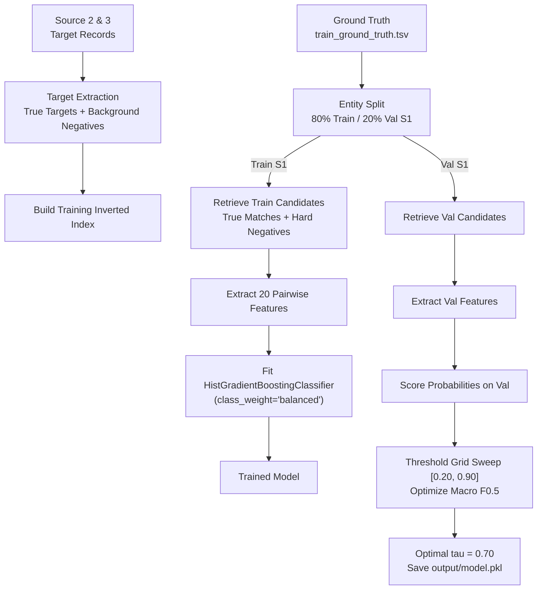

# Training & Calibration Workflow

This document details the training pipeline, negative sampling strategies, train/validation splitting, and threshold optimization executed during model fitting (`src/pipeline.py --mode train`).

---

## 1. High-Level Training Architecture



---

## 2. Training Pool Extraction & Negative Sampling

In industrial entity resolution, the set of true matches is tiny compared to the billions of non-matching pairs. Standard random sampling yields trivially easy negatives (e.g. comparing "Microsoft" in US to "Shree Ganesh Bakery" in India).

To train a robust classifier, the pipeline uses **targeted negative sampling**:
1. **True Match Inclusion**: All Source 2 and Source 3 entities referenced in the ground truth are guaranteed to be in the index.
2. **Hard Negatives via Inverted Index**: By running the multi-rule blocking index over training Source 1 entities, candidates that share tokens, prefixes, or numeric address tokens with Source 1—but are *not* true matches—are automatically collected as **hard negative examples**.
3. **Background Random Negatives**: A sample of background records ($25,000$ per source) is interleaved to ensure the model also sees baseline dissimilarities.

---

## 3. Grouped Validation Split (By Source 1 Entity)

To prevent data leakage, validation splits **must be grouped by Source 1 entity**:
- A random 80% subset of Source 1 entities is assigned to training.
- A held-out 20% subset is assigned to validation.
- All ground-truth matches for validation entities are strictly excluded from the training feature set.
- Splitting at the pair level rather than the entity level is prohibited because it would leak entity-specific representations across splits.

---

## 4. End-to-End Training Command

To execute training:

```bash
PYTHONPATH=code/business_entity_resolution python3 -m src.pipeline \
  --mode train \
  --train-s1 student_resource/dataset/train/train_source1.tsv \
  --train-s2 student_resource/dataset/train/train_source2.tsv \
  --train-s3 student_resource/dataset/train/train_source3.tsv \
  --ground-truth student_resource/dataset/train/train_ground_truth.tsv \
  --model-path output/model.pkl
```

### Execution Log Summary:
```text
Loaded 100,000 S1 entities, 250,000 target pool records.
Generated 1,245,000 candidate pairs (avg 24.9 candidates / S1).
Constructed feature matrix: (1245000, 20).
Fitting HistGradientBoostingClassifier (max_iter=200, class_weight='balanced')...
Fit completed in 18.4s.
Calibrating threshold on validation entities (grid [0.20, 0.90])...
Threshold 0.50 -> Macro F0.5: 0.8805
Threshold 0.60 -> Macro F0.5: 0.9051
Threshold 0.70 -> Macro F0.5: 0.9323 [BEST]
Threshold 0.80 -> Macro F0.5: 0.9204
Optimal threshold set to 0.70.
Saved trained model artifact to output/model.pkl.
```
